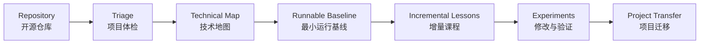

# 从零开始学习开源项目

<p align="center">
  <strong>把一个陌生的开源仓库，变成一套能运行、能验证、能迁移的实践课程。</strong>
</p>

<p align="center">
  <a href="https://github.com/ybl2020/learn-open-source-repo/actions/workflows/validate.yml"></a>
  <a href="https://github.com/ybl2020/learn-open-source-repo/blob/main/LICENSE"></a>
  <a href="https://github.com/ybl2020/learn-open-source-repo/stargazers"></a>
  
</p>

<p align="center">
  <a href="#为什么做这个-skill">为什么做</a> ·
  <a href="#它会怎么教你">工作方式</a> ·
  <a href="#快速开始">快速开始</a> ·
  <a href="#课程输出格式">课程格式</a> ·
  <a href="#能力边界">能力边界</a>
</p>

---

`learn-open-source-repo` 是一个面向 Codex 的项目式学习 Skill。你提供 GitHub、GitLab 地址或本地仓库，它负责完成仓库体检、环境搭建、运行验证、课程拆分、逐课讲解、实验设计和项目迁移。

它的目标不是替你“把项目跑起来”，而是帮助你逐步做到：

```text
Explain 能说清楚
→ Locate 能找到实现
→ Modify 能修改
→ Verify 能验证
→ Transfer 能迁移
```

## 为什么做这个 Skill

学习开源项目时，常见的困难不是缺少代码，而是：

- README 能看懂，但不知道应该先学什么；
- 项目成功启动，却看不懂数据在内部怎样流动；
- 框架封装太完整，只会调用现成接口；
- 教程只展示“正确结果”，没有分析噪声、误判和失败场景；
- 学完示例后，不知道怎样用到自己的项目；
- 仓库太大，容易陷入逐文件阅读，却没有形成知识主线。

这个 Skill 将仓库转换成一条有前置关系的学习路径：



## 它会怎么教你

### 1. 先判断项目值不值得学

在安装依赖前检查：

- 技术栈、入口、示例和测试；
- 核心能力是否真的能从代码中看到；
- 是否需要付费 API、大型模型、数据库或特殊硬件；
- 项目是否过时、过度封装或不适合当前学习目标；
- 更适合完整学习、局部学习，还是更换项目。

### 2. 自动确定学习范围

优先使用你已经明确的目标。

如果没有目标，Skill 会列出仓库涉及的主要技术供你选择；如果你也不知道该选什么，则默认学习全部核心技术，并按照前置依赖排序，而不是机械地逐文件讲解。

### 3. 先运行，再讲解

每节课都会尽量运行真实示例，并区分：

- `Expected Result / 文档预期结果`
- `Actual Result / 本机实际结果`
- `Inference / 尚未运行时的推断`

出现兼容性修改、模型文件映射或依赖修复时，会明确说明，不会悄悄改完后只展示成功结果。

### 4. 每节课只增加有限的新概念

课程通常按照下面的顺序展开：

```text
最小原理
→ 数据准备
→ 核心机制
→ 完整流程
→ 质量优化
→ 性能优化
→ 测试与评估
→ 项目迁移
```

每课都会说明：上一课做到了什么、本课新增什么、当前完整流程是什么、还存在什么问题、下一课将解决什么。

### 5. 不把“答案正确”当作“系统正确”

对于 RAG、Agent 和 LLM 项目，Skill 会继续追问：

- 答案是否真的来自检索上下文？
- 模型是否依靠自身知识碰巧答对？
- 相似度阈值是否合理？
- Top-K 是否带入噪声？
- 示例宣称的技术是否真的在代码中实现？

### 6. 最终迁移到一个项目

映射优先级为：

```text
当前真实项目
→ 历史项目
→ 职业或学习目标
→ 持续使用的虚拟学习项目
```

没有合适的真实项目时，Skill 会创建一个明确标注的 `Hypothetical Project / 虚拟学习项目`，并在后续课程中持续扩展同一个项目，不会每节课随意换案例。

## 快速开始

### 安装

```bash
git clone https://github.com/ybl2020/learn-open-source-repo.git
mkdir -p ~/.codex/skills/learn-open-source-repo
cp -R learn-open-source-repo/skill/. ~/.codex/skills/learn-open-source-repo/
```

### 使用

提供一个仓库地址：

```text
$learn-open-source-repo 带我从零学习这个项目：
https://github.com/example/project
```

指定学习目标：

```text
$learn-open-source-repo 我想通过这个项目重点学习 RAG、Reranking 和评估，
请先分析仓库，再为我制定课程。
```

继续课程：

```text
使用 $learn-open-source-repo 继续下一课。
```

## 课程输出格式

每节课默认使用以下中英双语结构：

1. 本节目标 / Lesson Goal
2. 上一课回顾 / Previous Lesson Review
3. 本节新增了什么 / What This Lesson Adds
4. 当前完整流程 / Current End-to-End Flow
5. 核心概念 / Core Concepts
6. 代码关键点 / Key Code
7. 实际运行方式 / How to Run
8. 跑通后的结果 / Execution Results
9. 结果精炼讲解 / Concise Result Explanation
10. 目前还存在什么问题 / Remaining Problems
11. 下一课解决什么 / Next Lesson Preview
12. 对你的项目有什么用 / Application
13. 一句话总结 / One-Sentence Summary

当一个代码示例包含多个问题时：

- 相同功能：重点分析一个问题，其他问题展示真实结果并简要带过；
- 不同功能、分支或失败模式：分别完整分析；
- 该规则只用于压缩重复问题，不会省略 Embedding、Vector Store、Top-K 等正常技术讲解。

## 内置仓库扫描

Skill 附带一个只读扫描脚本，可快速定位仓库规模、技术清单、入口文件、示例和测试：

```bash
./skill/scripts/inspect_repository.sh /path/to/repository
```

它只用于建立初步地图，重要结论仍需通过真实代码验证。

## 项目结构

```text
learn-open-source-repo/
├── README.md
├── LICENSE
├── .github/
│   └── workflows/
│       └── validate.yml
├── scripts/
│   └── validate_skill.py
└── skill/
    ├── SKILL.md
    ├── agents/
    │   └── openai.yaml
    ├── references/
    │   ├── repository-intake.md
    │   ├── lesson-template.md
    │   ├── teaching-rules.md
    │   └── evaluation-rubric.md
    └── scripts/
        └── inspect_repository.sh
```

## 学习完成标准

不会因为所有示例都运行成功，就宣布已经学完。完整学习至少包括：

- 能描述项目架构和真实运行链路；
- 跑通代表性示例；
- 每个主要模块至少完成一次有意义的修改；
- 能解释一个失败或不理想结果；
- 能把技术映射到真实或持续虚拟项目；
- 能形成不夸大的简历或面试表达。

## 能力边界

- 仓库无法运行时，仍可进行代码分析，但必须标注为“未在本机验证”。
- Skill 不保证任何第三方仓库都能安装成功。
- 自动扫描不能替代阅读核心实现。
- 默认不会将虚拟项目、模拟数据或推测包装成真实经历。
- 对大型模型、付费服务和外部基础设施，会先说明成本与依赖。

## Roadmap

- [x] 仓库体检与技术地图
- [x] 目标缺失时的技术选择机制
- [x] 中英双语增量课程模板
- [x] 真实运行结果与问题诊断
- [x] 项目映射与五级学习评估
- [x] 本地只读仓库扫描脚本
- [ ] 增加可选的课程进度文件模板
- [ ] 增加更多语言和构建系统的扫描规则
- [ ] 使用更多不同类型仓库进行前向验证

## Contributing

欢迎通过 Issue 提交以下内容：

- 某类仓库缺失的检查规则；
- 课程结构中的重复或断层；
- 实际教学中无法解释清楚的示例；
- 新语言、框架或构建工具的识别规则。

提交修改前，请运行：

```bash
python3 scripts/validate_skill.py skill
bash -n skill/scripts/inspect_repository.sh
```

## License

本项目使用 [MIT License](LICENSE)。
